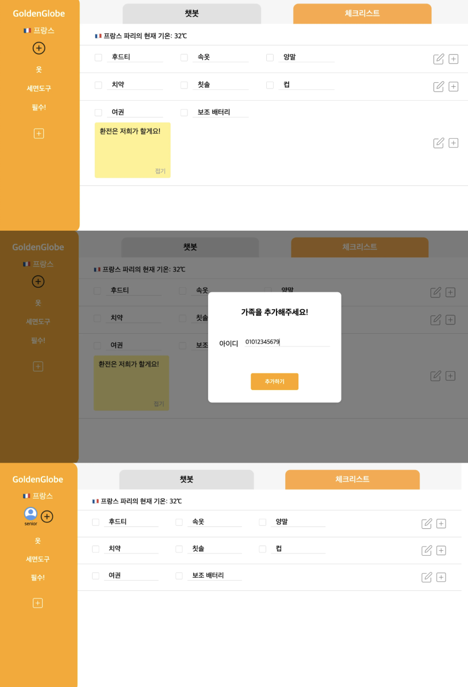
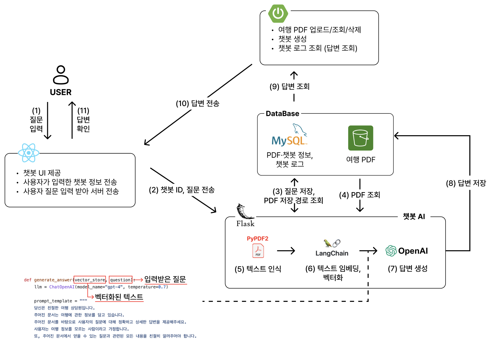
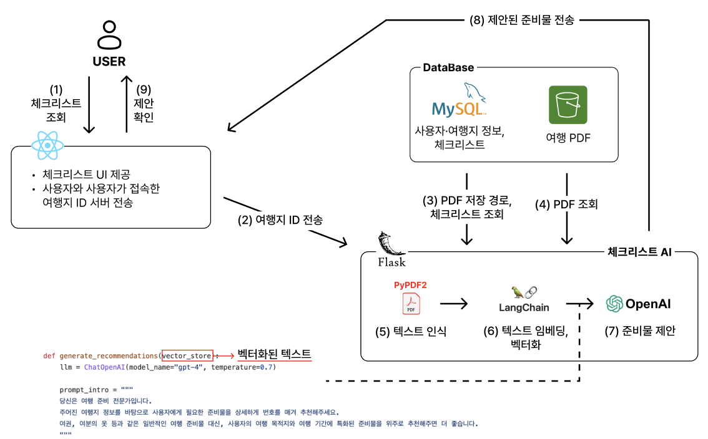

# Team-Info
| (1) 과제명 | GoldenGlobe : 시니어를 위한 LLM과 RAG 기반 맞춤형 여행 챗봇, 체크리스트 서비스
|:---  |---  |
| (2) 팀 번호 / 팀 이름 | 03-이대뎅김 |
| (3) 팀 구성원 | 김근주 (2071006): 리더, 백엔드, AI, 배포   김현수 (2073100): 팀원, 프론트엔드, 와이어프레임 및 디자인    원재영 (2176225): 팀원, 백엔드, AI	|
| (4) 팀 지도교수 | 이형준 교수님 |
| (5) 팀 멘토 | 김동수 / CTO / 엘핀 |
| (6) 과제 분류 | 산학과제 |
| (7) 과제 키워드 | 여행, 시니어, 챗봇, RAG, LLM  |
| (8) 과제 내용 요약 | 시니어와, 시니어를 가족 구성원으로 둔 나머지 가족들의 효율적인 여행 준비를 돕는 서비스입니다.    챗봇 기능을 통해 시니어가 주도적으로 여행을 파악하고 준비할 수 있도록 돕고, 여행지 맞춤 생성형 공유 체크리스트 기능을 통해 여행 준비의 효율성을 증대시킵니다. |

# Project-Summary
| 항목 | 내용 |
|:---  |---  |
| (1) 문제 정의 | **[본 과제를 통하여 해결 / 완화하고자 하는 문제]**  - 시니어 개인 혹은 시니어와 함께하는 가족이 여행을 준비할 때 겪는 여러 어려움   1. **시니어** : 가족 여행, 해외 여행, 패키지 여행을 가고자 하는 시니어 	- 검색 시간 소요 : 인터넷에 익숙하지 않아 여행에 필요한 정보에 접근하는 데 시간이 많이 소요됨. 여행 관련 문서에서 필요한 정보를 찾는데 시간이 소요됨.  - 정보 부족 : 세부 일정을 확인하기 위해 가족의 답변을 기다리거나, 전화 상담이나 Q&A 게시판을 이용해야 하는 등 여러 절차를 거쳐야 함.   2. **가족** : 시니어와 함께하는 여행을 떠나려는, 혹은 여행을 보내드리려는 가족(자녀 입장) - 정보제공의 어려움 : 시니어와 함께 여행을 가거나 시니어의 여행을 도울 때 추가적인 설명이나 정보를 제공해야 함  - 준비물 공유 : 시니어와 함께 여행 준비물 목록을 한번에 공유하고 확인할 수 있는 플랫폼이 없어 불편함.  실제로 시니어와의 여행 준비 과정에서 겪는 어려움을 주제로 설문조사를 진행한 결과,   - 여행 관련 문서를 정리하고, 관련 정보를 찾는데 어려움을 겪었다는 응답 : **89.3%**  - 그 외에, 정보 제공의 어려움을 겪었다는 응답 : **48%**   - 준비물 준비 및 확인으로 어려움을 겪었다는 응답 **41.3%**  
| (2) 기존연구와의 비교 | **[유사한 과제 / 연구 / 서비스 / 시스템]**   - **아고다** : 고정된 키워드(ex.'캐쉬백 리워드','Acoda Cash')로만 문의 가능  - **익스피디아**  : 챗봇 파일 첨부 지원X -> 사용자 개개인 맞춤형 답변 제공 불가   - **스카이 스캐너** : 챗봇 서비스 제공X, QnA 문의를 남기는 서비스만 존재  - **하나투어** : ‘AI 채팅상담 서비스'가 있으나 최신 정보 답변 X   - **트리플** : 챗봇 서비스 제공X, 공유 체크리스트가 있으나 기본 템플릿만 제공     **[본 과제가 유사 과제에 비해 갖는 장점]**   **공통** : 챗봇 서비스와 체크리스트 서비스 동시에 제공한다.     1. **챗봇**   - 일반적 답변이 아닌, 관련 PDF를 기반으로 한 사용자 맞춤형 답변 제공   - 고정된 키워드가 아닌, 자유로운 의사소통 기반   - RAG를 기반으로 답변하기에, 거짓 없는 정확한 답변 제공     2. **체크리스트**   - 기본 템플릿이 아닌, 여행지 날씨와 관련 PDF를 기반으로 한 맞춤형 체크리스트 제안
| (3) 제안 내용 | 시니어와 그 가족이 주도적으로 여행을 즐기고, 준비 과정을 간편하게 관리할 수 있도록 돕는다.     **공통** : 가족 단위의 여행에 따르는 소통 부담과 피로를 덜어 더 만족감 높은 여행을 경험할 수 있다.   1. **시니어**   - RAG,LLM을 활용한 챗봇을 활용해 여행할 때 필요한 정보 검색 시간을 줄이고 보다 정확한 답변을 제공받는다.   - 체크리스트 제안 기능과 공유 체크리스트 기능을 통해 준비물 준비 시간을 줄이고, 효율적인 준비를 할 수 있다.    2. **시니어의 가족**   - 체크리스트 기능을 통해 여행 준비물을 한 페이지에서 편리하게 관리할 수 있다.   
| (4) 기대효과 및 의의 | - 시니어가 주도적으로 여행에 참여할 수 있다. - 시니어는 챗봇을 통해 검색시간을 줄이고, 보다 정확한 답변을 제공받을 수 있다.  - 시니어가 여행하고자 하는 나라의 상황(날씨, 관광지, 음식 등)에 적합한 준비물을 챙겨 예상하지 못한 상황을 대비할 수 있게 된다. - 시니어와 가족은 체크리스트를 통해 여행 준비물을 한꺼번에 편리하게 관리할 수 있다. - 가족 단위의 여행에 따르는 소통 부담과 피로를 덜어 더 만족감 높은 여행 경험을 제공할 수 있다.
| (5) 주요 기능 리스트 | 1. '챗봇' 기능 - LLM, RAG를 활용하여 pdf 기반 챗봇을 생성한다. - 여행 전자 영수증, 패키지 화면 pdf, 액티비티 예약 캡쳐본 등 여행 관련 문서를 저장해 두면 언제든지 해당 문서의 내용을 추출하여 정확한 질의응답을 할 수 있다.  2. '체크리스트' 기능 - 날씨 api와 생성형 ai를 사용해, 여행지의 특성에 맞는 맞춤형 준비물을 기본적으로 생성한다. - 사용자가 업로드한 pdf 분석을 통한 준비물을 추천한다. - 가족들이 함께 체크리스트를 작성하여, 시니어가 꼼꼼하게 준비물을 챙길 수 있도록 돕는다. - 체크리스트에서, 가족들이 시니어에게 메모를 남겨 중요한 부분을 다시 한 번 강조할 수 있다. 

 
 
# Project-Design & Implementation
| 항목 | 내용 |
|:---  |---  |
| (1) 요구사항 정의 | - **요구사항 정의서** (기획의 전반적인 설명)    - **ui 디자인** (프론트의 전반적인 설명)     - **ER 다이어그램** (백앤드의 전반적인 설명)    - **API 명세서** 
| (2) 전체 시스템 구성 |     **CLIENT**   - Vercel : 서버리스 플랫폼으로 프론트엔드 애플리케이션을 배포하고 관리한다.   - React : 사용자 인터페이스를 구축하기 위한 자바스크립트 라이브러리로, 클라이언트 측 UI를 담당한다. 사용자가 입력한 데이터를 서버로 전송하고, 서버에서 받은 응답을 화면에 표시하여 시니어에 최적화된 UI 제공한다.   - Axios : 클라이언트 측에서 서버로 HTTP 요청을 보내고 응답을 받을 수 있게 해주는 JavaScript 기반의 HTTP 클라이언트 라이브러리이다. GoldenGlobe에서는 REST API와의 상호작용을 위해 사용되었으며, 이를 통해 사용자가 입력한 데이터를 서버에 전달하고 서버의 응답을 쉽게 처리할 수 있다.     **SERVER**   - Spring Boot : 프론트 요청에 따라 DB에 데이터를 저장하거나 필요한 데이터를 찾아서 반환한다.  - JWT (JSON Web Token) : 회원 가입 및 로그인 기능에서 인증과 권한 부여를 위한 토큰 방식의 인증 도구이다. 사용자의 인증 정보를 JSON 형식으로 인코딩하여 토큰 형태로 클라이언트와 서버 간에 전달한다.   - Flask : Python 기반의 마이크로 웹 프레임워크이다.GoldenGlobe에서는 AI 챗봇과 PDF 데이터를 분석하는 기능을 제공하기 위해 Flask를 사용해 API 서버를 구축했다.   - Docker : Spring Boot, Flask 서버 컨테이너화한다.   - AWS EC2 : Docker로 패키징된 애플리케이션을 호스팅한다.   - GithubActions : 코드 변경 시 배포를 자동화한다.   **DB** - MySQL : 오픈 소스 관계형 데이터베이스 관리 시스템으로, 구조화된 데이터를 저장하고 효율적으로 관리한다. GoldenGlobe에서는 사용자, 여행지 정보, 체크리스트 항목 등을 체계적으로 저장하고 조회하기 위해 MySQL을 데이터베이스로 활용하였다.   - AWS S3 : 클라우드 기반의 객체 스토리지 서비스로, 대용량 데이터를 안전하게 저장하고 관리할 수 있다. GoldenGlobe에서는 사용자들이 업로드한 여행 관련 PDF 파일을 저장하고 이를 AI 분석 모듈에서 접근할 수 있도록 하기 위해 S3를 활용하였다.    **AI**   - PyPdf2 : 여행 관련 다수의 PDF 문서들을 자동으로 처리하기 위해 PyPDF2 라이브러리를 활용하였다. PyPDF2를 이용하여 사용자가 첨부한 PDF 문서들에서 텍스트를 추출한다.  - LangChain : 여러 개의 문서를 연결하고 자연어 처리 모델과 상호작용을 위한 라이브러리이다. GoldenGlobe에서는 PyPDF2로 추출한 텍스트 데이터를 LangChain의 체인으로 구성하여, 이후 단계에서의 OpenAI 모듈이 사용자의 질문에 대해 문서 내용을 참조하는 정확한 답변을 제공할 수 있도록 하였다.   - OpenAI : 챗봇의 자연어 질문에 답변을 제공하기 위한 인공지능 API이다. GoldenGlobe에서는 langchain이 PDF 문서에서 처리한 내용을 기반으로 사용자의 다양한 질문에 적절한 응답을 생성하고, 필요한 체크리스트 준비 항목을 사용자에게 자동으로 제안하는 데 이용되었다. | 
| (3) 주요 엔진 및 기능 설계 | **[회원가입/로그인]**  (1) 유저에게서 회원 가입 정보(이름, 생년월일, 전화번호, 비밀번호, 닉네임, 프로필, 성별)를 입력받는다.  (2) 유저 정보를 담아 React에서 서버로 POST 요청을 보낸다. (3) 서버에서는 사용자의 정보를 MySQL의 user 테이블에 저장한다. 이후 클라이언트 측에서 서버로 요청을 보내면 유저 정보를 조회하고 수정, 삭제할 수 있다. (4) 유저가 로그인을 하게 되면 프론트에서 아이디(전화번호)와 비밀번호를 서버로 POST 한다. (5) 서버에서는 이 정보를 MySQL의 user 테이블의 정보와 비교해서, 회원이 맞는지 확인하고, 맞다면 JWT 토큰을 만들어 response 메시지로 클라이언트 측에 넘겨준다. (6) 이후 클라이언트는 이 토큰을 헤더에 붙여서 서버에 해당 유저가 인증된 사용자임을 확인시켜준다.  **[여행지 관리]**  (1) 유저는 국가/도시/날짜를 입력해 여행지를 생성할 수 있다. 프론트는 해당 정보를 입력받아 서버에 POST 요청을 보낸다.  (2) 서버는 MySQL의 travelList 테이블에 해당 여행 정보를 저장한다. 이 정보를 바탕으로 여행지가 생성되며 동시에 해당 여행지와 연동된 체크리스트와 챗봇이 자동 생성된다. (3) 유저는 가족의 전화번호를 입력하여 여행지를 공유할 수 있다. 여행지에 가족을 추가하면 해당 여행은 sharedList에 저장되어 공유된 모든 사용자에게 나타나게 된다.   **[챗봇]**   (1) 유저가 챗봇에서 사용될 PDF를 업로드할 수 있다. 프론트는 해당 PDF를 서버에 POST 한다. (2) 서버는 AWS S3 bucket에 PDF를 저장한다. (3) 저장된 bucket 경로를 MySQL의 pdfList 테이블에 저장한다. (4) 저장이 완료되면 사용자는 챗봇을 사용할 수 있다. 사용자가 질문을 던지면 서버에서는 PyPDF2를 통해 PDF의 텍스트를 인식한다. (5) 인식된 텍스트는 LangChain과 HuggingFace 라이브러리를 통해 벡터화한다. (6) OpenAI API를 사용해 질문에 대한 답변을 추출한다. (7) 추출된 답변은 MySQL의 chatBotLog 테이블에 저장되며, 서버에서는 이 로그를 사용자에게 전달한다.   **[체크리스트]**  (1) 체크리스트는 사용자가 자유롭게 그룹을 추가하고 그룹 내에 아이템(항목)을 추가할 수 있다. (예: 그룹: 세면도구 / 아이템: 칫솔, 치약) (2) 그룹과 아이템은 각각 서버에 POST 된다. 각각의 그룹과 아이템은 유저가 원할 때 언제든 생성/수정/삭제할 수 있다. 각각의 API는 유저의 호출에 따라 서버에 전달된다. (3) 체크리스트에는 메모 기능도 있다. 메모는 실제 포스트잇처럼 UI를 구성하였고 메모 안에 텍스트를 입력하면 서버에 전달된다. 해당 메모는 체크리스트와 함께 언제든 조회/생성/삭제할 수 있다. (4) 또한 체크리스트는 자동으로 템플릿을 제공해 유저의 피로를 덜어준다. 챗봇에서 업로드한 PDF를 통해 자동으로 맞춤형 준비물을 추천하여 체크리스트를 제공한다. 
| (4) 주요 기능의 구현 | **[챗봇]**   - 사용 모듈 :  React - SpringBoot(챗봇) - Database(chatBogLog, pdfList, S3 bucket) - Flask(PyPDF2, LangChain, OpenAI) - 목적 : 저장된 PDF를 바탕으로, 사용자의 질문에 맞는 정확한 답변을 제공한다.  - 기능 흐름 및 구현 (1) 사용자가 질문을 입력한다. (2) React는 사용자가 입력한 질문과, 챗봇 ID를 서버로 전송한다. (3) chatBotLog 테이블에 질문을 저장하고, 챗봇 ID를 통해 pdfList 테이블에 저장된 PDF의 경로를 확인한다. (4) 위에서 얻은 PDF 경로를 통해 AWS S3 bucket에서 PDF를 확인한다. (5) Flask에서 PyPDF2 라이브러리를 이용해 PDF에서 텍스트를 인식한다. (6) 인식한 텍스트를 LangChain으로 임베딩하고, 벡터화한다. (7) 벡터화된 텍스트를 가지고, OpenAI API를 이용해 입력받은 질문에 대한 답변을 생성한다. (8) 생성한 답변을 chatBotLog 테이블에 저장한다. (9) Spring Boot에서 생성된 답변이 포함된 chatBotLog 테이블을 조회한다. (10) 조회한 로그(답변)을 React에 전송한다. (11) React에서 응답받은 로그 및 답변을 유저에게 반환한다.  - 프롬프팅 이전   - 프롬프팅   - 프롬프팅 이후     **[체크리스트]**  - 사용 모듈 : React - Database(checkList, S3 bucket) - Flask(PyPDF2, LangChain, HuggingFace, OpenAI)  - 목적 : 저장된 PDF를 바탕으로, 사용자가 보다 편리하게 필요한 준비물을 챙길 수 있도록, 항목을 제안한다.  - 기능 흐름 및 구현  (1) 사용자가 체크리스트 페이지를 조회한다. (2) React는 사용자 정보와, 사용자가 접속한 체크리스트의 여행지 ID를 서버에 전송한다. (3) 여행지ID로 pdfList 테이블에 저장된 PDF의 경로를 확인한다. (4) 위에서 얻은 PDF 경로를 통해 AWS S3 bucket에서 PDF를 확인한다. (5) Flask에서 PyPDF2 라이브러리를 이용해 PDF에서 텍스트를 인식한다. (6) LangChain으로 인식한 텍스트를 임베딩하고, 벡터화한다. (7) 벡터화된 텍스트를 가지고, OpenAI API를 이용해 필요한 준비물 항목을 생성한다. (8) 제안된 준비물 항목을 React에 전송한다. (9) React에서 응답받은 항목을 유저에게 반환한다.  - 프롬프팅 이전  - 프롬프팅   - 프롬프팅 이후
| (5) 기타 |  |

 

# Evaluation

| 항목 | 내용 |
|:---|:---|
| (1) 평가(Evaluation) |  |

## 사용자 설문 결과 표
- 5: 매우 그렇다.
- 4: 약간 그렇다
- 3: 보통이다
- 2: 아니다
- 1: 전혀아니다.

| 전반적인 만족도 | 챗봇 기능 만족도 | 체크리스트 기능 만족도 | 실 사용 의향 | 개선됐으면 하는 점                   | 기타 의견                                              |
|----------------|----------------|--------------------|-------------|----------------------------------|--------------------------------------------------|
| 5              | 5              | 4                  | 5           | 체크리스트를 한 화면에 보여주는 것 뿐만 아니라 왼쪽에서 카테고리를 클릭하면 그 카테고리에 해당하는 체크리스트만 보여주는 기능이 있어도 더 좋을 것 같아요!| 여행 갈 때 맨날 pdf 따로 저장해두고 찾고 하느라 정신 없는데 정말 유용하게 쓸 것 같아요! |
| 4              | 5              | 5                  | 5           | UI가 개선됐으면 좋겠습니다.             | 시니어와 함께 여행을 다니고자 하는 가족들에게 도움이 될 것 같습니다.                     |
| 5              | 5              | 5                  | 5           | 모바일 화면에서도 예쁘게 보였으면 좋겠습니다 | 따로 없습니다! |
| 5              | 5              | 5                  | 5           | 모바일 최적화된 디자인 | 지금까지 없었던 신선한 서비스인 것 같습니다.                     |
| 5              | 5              | 5                  | 5           | 챗봇 답변 시 답변 생성중이라는 문구가 뜨면 더 편리할 것 같아요 | 여행하려는 나라의 현재 날씨를 알려줘서 좋아요. 여행을 많이 다니는 사람에게 유용할 것 같습니다                  |
| 5              | 5              | 5                  | 5           | 특별히 없다.                        | 가능이 편리하고 챗봇이 있어 따로 검색을 할 필요가 없다는 것이 가장 좋았다.           |
| 5              | 5              | 5                  | 5           | 딱히 없습니다 | 너무 만족합니다! 실제로 사용할 수 있게 되었으면 좋겠어요!! |
| 4              | 4              | 4                  | 4           | 챗봇이랑 날씨? 응답 속도가 빨라지면 좋을 것 같습니다. | 모바일 반응형 |
| 5              | 4              | 5                  | 5           | 속도가 좀 더 빠르면 좋겠습니다.             | 여행에 매우 유용하게 사용할 수 있을 것 같습니다.                    |

## 항목별 평균 점수

- **전반적인 만족도 평균:** 4.77
- **챗봇 기능 만족도 평균:** 4.77
- **체크리스트 기능 만족도 평균:** 4.77
- **실 사용 의향 평균:** 4.88

위 결과는 사용자 9명의 피드백을 기반으로 작성되었다. 설문 결과를 바탕으로 개선점을 반영해 나갈 예정이다.

---

# Conclusion

| 항목 | 내용 |
|------|------|
|**(1) 프로젝트 내용 요약**|시니어와 가족이 여행 준비 과정에서 겪는 어려움을 해결하고자, 시니어를 위한 여행 지원 플랫폼을 개발했다. 주요 대상은 시니어 개인 또는 시니어와 함께 여행을 준비하는 가족으로, 이들이 정보 검색과 준비 과정에서 겪는 불편함을 최소화하고자 하였다.  구체적으로, 시니어는 인터넷에 익숙하지 않아 여행 정보에 접근하는 데 시간이 많이 소요되고, 가족과 소통하는 과정에서 추가적인 어려움을 겪는 경우가 많았다. 가족 또한 시니어를 돕는 과정에서 정보 제공과 준비물 공유의 번거로움을 느끼고 있었다. 이를 해결하기 위해 우리는 두 가지 주요 기능, 챗봇과 체크리스트를 개발했다.  1. **챗봇 기능**  - 사용자가 업로드한 PDF 문서를 기반으로 하여, 개인화된 맞춤형 답변을 제공하는 챗봇을 개발했다.    - 기존 여행 플랫폼들이 고정된 키워드에 의존하거나 첨부 파일 지원이 부족한 문제를 해결하며, RAG(검색 기반 생성) 모델을 활용해 보다 정확한 답변을 제공할 수 있도록 설계했다.    - 이를 통해 시니어가 여행에 필요한 정보를 손쉽게 검색할 수 있도록 돕고, 불필요하게 소요되는 시간을 줄였다.  2. **체크리스트 기능**    - 여행지 날씨와 관련 문서를 분석하여 맞춤형 준비물 목록을 생성하며, 사용자가 체크리스트를 가족과 공유하고 함께 작성할 수 있도록 했다.    - 가족 단위의 소통을 돕기 위해 메모 기능을 추가해, 중요한 준비물을 강조하거나 확인할 수 있도록 했다.    - 이로써 가족들이 시니어와 협업해 효율적으로 여행을 준비할 수 있도록 하였다.  GoldenGlobe는 단순한 여행 지원을 넘어, 시니어가 여행 준비 과정에서 주도적인 역할을 할 수 있도록 돕는 데 중점을 두었다.
|**(2)보완할 점**|1. **테스트 코드를 작성하지 못한 점**    - 현재 프로젝트는 기능 구현에 집중했으나, 시스템의 안정성과 유지보수성을 높이기 위해 충분한 테스트 코드를 작성하지 못했다. 추후 테스트 코드를 추가 작성하여 품질 보증을 강화할 필요가 있다.  2. **API 응답 속도를 개선해야 하는 점**   - 프로젝트 초기에 REST Template을 활용해 API 호출을 처리했으나, 이는 응답 속도가 다소 느리고 리소스를 많이 소비하는 단점이 있었다. 추후 개발에서는 HTTPUrlConnection으로 전환하거나 비동기 처리 방식을 도입해 API 성능을 최적화해야 한다.  3. **DB를 재설계해야 하는 점**    - 현재 데이터베이스 설계에서 식별자로 UUID를 활용하지 않아 확장성과 고유성 관리가 어려운 부분이 있었다. 추후 데이터베이스 구조를 재설계해 UUID를 도입하면 데이터 충돌 문제를 방지하고 시스템 확장성을 높일 수 있을 것이다.  4. **서비스 주체성 부족**    - 최종 발표회에서 "시니어를 위한 서비스지만 가족의 도움에 더 의존하는 구조 같다"는 피드백을 받았다. 시니어가 주도적으로 사용할 수 있도록 UI/UX를 개선하고, 음성 안내나 간단한 워크플로우 같은 시니어 친화적인 기능을 추가할 필요가 있다.
|**(3) 팀원 후기**|**재영** 이번 졸업 프로젝트에서 백엔드와 AI 개발을 맡아 많은 것을 배울 수 있었다. 특히, AI 개발은 완전히 처음 해 보는 분야였기에 처음에는 많은 어려움을 겪었다. RAG 모델을 활용해 PDF 문서를 분석하고 사용자 맞춤형 답변을 제공하는 챗봇을 설계하는 과정은 복잡했지만, 다양한 자료를 찾아보고 학습하며 직면한 문제를 하나씩 해결해 가는 과정이 재미있었다. 결과적으로 만족스러운 결과물을 만들어냈고, 처음 도전한 AI 개발에서 좋은 성과를 낼 수 있어 큰 성취감을 느꼈다. 또한, 이번 프로젝트에서 처음으로 프론트엔드-백엔드 간의 협업을 경험했다. 백엔드에서 설계한 API가 실제로 프론트엔드와 연결되어 사용자 인터페이스에서 동작하는 것을 보며 협업의 중요성과 재미를 깊이 느꼈다. 서로의 작업 방식과 요구사항을 이해하고 조율하며, 기술적인 소통 능력을 키울 수 있었던 점이 매우 의미 있는 경험이었다. 이번 프로젝트를 통해 새로운 기술적 도전에 성공적으로 응답할 수 있었고, 협업을 통해 더 나은 결과를 만들어가는 과정을 경험하며 많은 것을 배웠다.|
